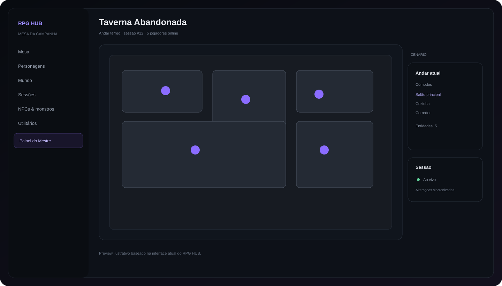
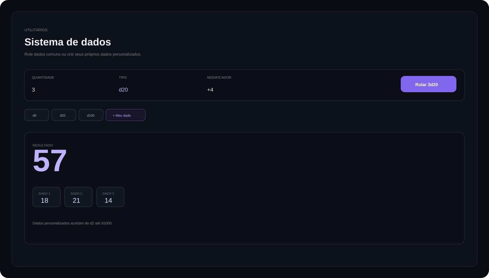
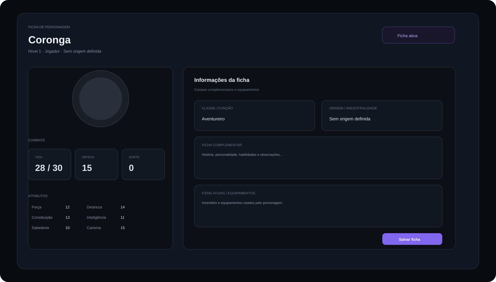
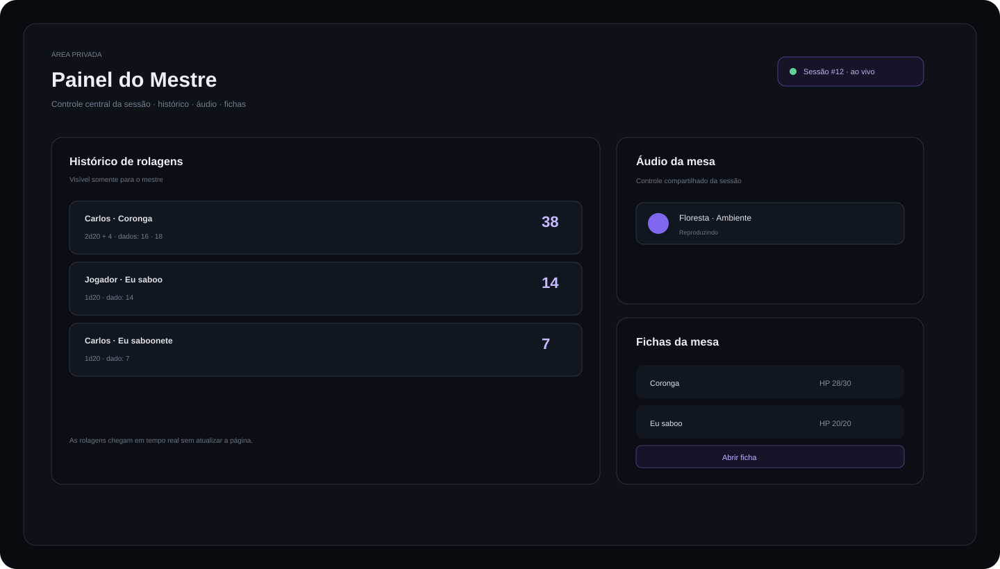

# ✦ RPG HUB

> **Uma mesa virtual para preparar, organizar, narrar e jogar campanhas de RPG em tempo real.**

**Visão Geral · Mesa · Mapa · Fichas · Dados · Áudio · Sessões · NPCs · Mundo persistente · Painel do Mestre · Temas personalizados · Realtime · Mobile**

<p align="center">
  
</p>

<p align="center"><strong>Carlos Henrique — RPG HUB</strong></p>

---

## Sobre o projeto

O **RPG HUB** é um projeto criado por **Carlos Henrique** para centralizar, em uma única aplicação, as ferramentas usadas durante uma campanha de RPG.

A proposta é reduzir a necessidade de alternar entre mapa, fichas, sites de rolagem, documentos e ferramentas externas. O Mestre prepara e conduz a campanha enquanto os jogadores acompanham o estado compartilhado da mesa em tempo real.

A estrutura atual separa preparação, informação e jogo:

```text
Login
  ↓
Campanha
  ↓
Visão Geral
  ↓
Mesa
  ├── Mapa / Mundo
  ├── Personagens
  ├── Sessões
  ├── NPCs & monstros
  ├── Utilitários / Dados
  ├── Painel do Mestre
  └── Crônica da mesa
```

**Status:** desenvolvimento ativo.

---

## Repaginação do mapa — 29/09/2026

A camada da Mesa foi revisada para eliminar inconsistências entre visualização, interação e escala do mapa.

### Criação e edição de cenário
- Criação visual de cômodos com arraste e prévia da área antes de abrir o formulário.
- Captura de ponteiro durante o desenho para evitar perda de eventos em mouse e toque.
- Geometria criada respeitando a escala atual do mapa.
- Cômodos rotacionados passam a considerar a caixa ocupada pela rotação ao permanecer dentro dos limites do mapa.
- Rotação direta na Mesa por alça `⟳` arrastável.
- Controles rápidos de rotação em `15°`, `−15°` e `0°` para o cômodo selecionado.
- Persistência e transmissão da rotação para os participantes.

### Zoom e viewport
- O mapa deixou de usar `transform: scale()` como mecanismo principal de zoom.
- O zoom agora altera as dimensões reais do canvas do mapa, mantendo as coordenadas do ponteiro coerentes.
- A viewport usa rolagem horizontal e vertical para mapas ampliados, sem simplesmente cortar o cenário.
- Faixa de zoom revisada para `75%` a `200%`, com retorno rápido para `100%`.
- Comportamento responsivo preservado em desktop e mobile.

### Grid, Snap e escala
- A grade passou a usar tamanho físico em pixels, formando células quadradas reais.
- Snap de posição usa o mesmo tamanho físico de célula em X e Y.
- Redimensionamento de cômodos usa a mesma referência de célula.
- Medição, criação de áreas e snap usam a mesma escala para evitar divergências.

### Medição
- Ferramenta de medir refeita para trabalhar em pixels e converter o resultado pela quantidade de unidades por célula.
- Distâncias diagonais usam a distância euclidiana real na viewport.
- O resultado apresenta células e unidades da campanha.
- Medição agora permanece correta durante zoom e rolagem.
- Foi adicionado comando `Limpar medição`.

### Áreas de efeito
- Criação por arraste foi reconstruída com captura de ponteiro.
- Círculo e quadrado usam o ponto inicial como centro.
- Cone usa o ponto inicial como vértice e a direção do arraste como orientação.
- Linha usa o ponto inicial como origem e a distância arrastada como comprimento.
- Tamanho e comprimento são armazenados em células, mantendo a área consistente com a grade.
- Áreas continuam persistentes e sincronizadas por Realtime.
- O Mestre recebe controle explícito para remover áreas.

### Interface do mapa
- Toolbar do mapa reorganizada para separar movimento, estrutura, medição, áreas, névoa, grade e visão.
- Painel lateral recebeu tratamento mais estável em telas estreitas.
- O container do mapa passou a tratar scroll e conteúdo ampliado como uma viewport real.
- Controles e overlays passaram a ser reposicionados após mudanças de tamanho do mapa.

### Validação
- `app.js`, `rpg-vtt-advanced.js`, `rpg-vtt-vision.js`, `rpg-combat-system.js` e `rpg-system-upgrades.js` passaram por validação de sintaxe.
- A página `mesa.html` continua carregando a camada de VTT.
- A validação visual completa com navegador autenticado não ficou disponível nesta rodada; por isso não foi registrada como teste concluído.

### Ajustes adicionais do motor de interação

- O mapa não depende mais de `transform: scale()` para representar zoom.
- A escala do mapa, a grade, o snap, a medição e as áreas compartilham uma mesma referência física de célula.
- O deslocamento de cenários respeita a área ocupada por elementos rotacionados, reduzindo o risco de deixar cômodos parcialmente fora do mapa.
- A rotação pode ser feita diretamente com uma alça visual no cenário e também pelos controles rápidos do cômodo selecionado.
- A viewport foi preparada para receber mapas maiores sem deslocar a interface lateral de forma inesperada.
- O fluxo de criação por desenho usa captura de ponteiro e prévia visual durante o arraste.
- O motor de VTT reduz o volume de renderizações e consultas periódicas, mantendo Realtime como mecanismo principal de atualização.

---
## Atualizações recentes — 29/09/2026

Esta versão registra a evolução da Mesa, do sistema de Mestre e das camadas de sincronização do RPG HUB.

### Mesa / mapa

- Grid configurável por andar, com espaçamento persistente e snap real aplicado ao movimento de entidades e ao redimensionamento de cômodos.
- Ferramentas de medição de distância em unidades da campanha.
- Áreas de efeito persistentes em círculo, quadrado, cone e linha.
- Fog of War persistente com regiões desenhadas pelo Mestre.
- Visão tática real por personagem/token, com alcance individual.
- Linha de visão calculada a partir do token.
- Paredes desenhadas no mapa que bloqueiam visão.
- O painel lateral da Mesa respeita a visibilidade: jogadores não recebem a lista de entidades/cômodos fora da área visível.
- Tokens fora de visão não permanecem interativos no DOM para jogadores.
- Jogadores não iniciam mais o fluxo de arrastar tokens; a alteração de posição depende do controle do Mestre.
- Grade desligada agora realmente remove o desenho da grade.
- Zoom do mapa utiliza uma área com rolagem para evitar corte do cenário.
- Toolbar do VTT foi reorganizada para evitar conflitos entre mover, estrutura, medição, áreas, névoa, paredes e visão.

### Mestre da Mesa

- Separação explícita entre **tipo de conta** e **proprietário da campanha**.
- O proprietário da campanha é a autoridade de edição da Mesa e das configurações compartilhadas.
- A interface diferencia a conta Mestre do papel exercido dentro da campanha, evitando apresentar um membro como administrador da Mesa.
- O cadastro de perfil não usa mais `user_metadata` para decidir privilégios de conta; novos perfis entram como jogador e a promoção para Mestre deve ocorrer por operação administrativa segura.
- Controles da Mesa, Painel do Mestre e Crônica continuam protegidos por `canEdit()` e pelas políticas RLS do banco.

### Combate + mapa

- Combate persistente por sessão.
- Iniciativa, rodada, turno, HP e condições sincronizados por Realtime.
- O token do combatente ativo recebe destaque no mapa.
- Condições são representadas visualmente nos tokens.
- O estado de combate é considerado pela camada de visão tática.
- Alterações de combate, movimento de tokens e mudanças de visão provocam atualização imediata do mapa.

### Segurança e banco

Foram adicionadas as estruturas:

```text
map_settings
map_walls
vision_sources
fog_regions
aoe_effects
combat_encounters
combatants
campaign_activity
```

As tabelas novas possuem RLS e regras de acesso compatíveis com o modelo da campanha, e as camadas principais estão habilitadas para Realtime quando necessário.

### Validação desta versão

- Arquivos JavaScript principais passaram por validação de sintaxe.
- A página `mesa.html` em produção carrega a camada de visão real.
- O último deploy de produção foi concluído com status `READY`.
- A verificação de runtime do Vercel não encontrou erros nas últimas consultas realizadas.

### Aviso de segurança pendente

O Supabase Security Advisor ainda sinaliza:

```text
auth_leaked_password_protection
Leaked Password Protection Disabled
```

Esse aviso depende de uma configuração administrativa do Supabase Auth e não foi considerado “corrigido” por código da aplicação. O recurso deve ser habilitado nas configurações de segurança do Auth para eliminar o warning.

---
# Preview

O repositório possui previews visuais para apresentar as principais áreas da aplicação.

| Mesa | Sistema de dados |
|---|---|
|  |  |

| Ficha de personagem | Painel do Mestre |
|---|---|
|  |  |

> Os previews são mantidos dentro de `docs/preview/` para que a documentação continue visualmente independente da aplicação publicada.

---

# Principais recursos

## 1. Autenticação e contas

- Login e cadastro.
- Recuperação de senha.
- Perfil do usuário.
- Nome de exibição.
- Identificação entre Mestre e jogador.
- Acesso protegido às áreas da campanha.
- Identidade **Carlos Henrique — RPG HUB** apresentada na tela de autenticação.
- Favicon próprio do RPG HUB nas páginas da aplicação.

A autenticação utiliza **Supabase Auth**.

---

## 2. Campanhas

O sistema trabalha com campanhas persistentes e participantes associados.

Recursos:

- Criar campanhas.
- Selecionar campanhas.
- Entrar em campanhas por código.
- Identificar o papel do participante.
- Diferenciar Mestre e jogador.
- Excluir campanhas quando permitido.
- Convite para participantes.
- Estado compartilhado da campanha.

Fluxo básico:

```text
Mestre cria campanha
        ↓
Compartilha o acesso
        ↓
Jogadores entram
        ↓
Todos passam a compartilhar o estado da campanha
```

---

# 3. Visão Geral

A **Visão Geral** foi separada da Mesa para evitar que o espaço de jogo fique poluído com informações administrativas.

Ela funciona como o dashboard da campanha e reúne atalhos e informações rápidas, como:

- Nome da campanha.
- Estado da campanha.
- Acesso à Mesa.
- Sistema de dados.
- Personagens.
- Áudio da sessão.
- Presença dos jogadores.
- Atualizações recentes.
- Recursos da campanha.
- Acesso aos utilitários.

A Mesa fica reservada para o jogo; a Visão Geral concentra a navegação e os resumos.

---

# 4. Mesa virtual

A **Mesa** é a área principal de jogo.

Ela possui uma interface com sidebar fixa, navegação por áreas e um espaço dedicado ao cenário.

### Navegação

- Visão geral.
- Mesa.
- Personagens.
- Mundo.
- Sessões.
- NPCs & monstros.
- Utilitários.
- Painel do Mestre — somente Mestre.
- Crônica da mesa — somente Mestre.

### Mapa / cenário

O Mestre pode trabalhar com:

- Locais.
- Andares.
- Cômodos.
- Entidades.
- Personagens.
- NPCs.
- Criaturas.
- Posicionamento.
- Movimento.
- Redimensionamento.
- Rotação de cômodos.
- Estado persistente do cenário.

As alterações do mundo são preparadas para sincronização em tempo real, evitando que cada jogador precise usar `F5` para acompanhar uma mudança.

---

# 5. Mundo persistente

A estrutura do mundo segue uma hierarquia simples:

```text
Campanha
└── Local
    └── Andar
        └── Cômodo
            └── Entidades
```

Isso permite montar um cenário com múltiplos andares e ambientes sem perder a organização.

O estado do cenário pode ser persistido para que o Mestre continue a campanha de onde parou.

### Atualizações em tempo real

Quando o Mestre altera elementos compartilhados, a aplicação utiliza o estado da campanha para distribuir essas mudanças aos participantes.

Exemplos:

- Adicionar cômodo.
- Alterar cômodo.
- Rotacionar cômodo.
- Mover entidade.
- Alterar posição.
- Adicionar personagem ao mapa.
- Remover personagem do mapa.
- Atualizar estado de elementos.

---

# 6. Personagens e fichas

As fichas receberam uma reformulação visual para transformar a consulta do personagem em uma experiência mais organizada e agradável.

A visualização atual utiliza um layout de ficha dividido em áreas, cards e blocos de informação com bordas arredondadas.

### Informações principais

- Nome.
- Nível.
- Jogador responsável.
- Classe / função.
- Origem / ancestralidade.
- HP atual.
- HP máximo.
- Defesa / CA.
- Sorte.
- Atributos.
- Armas.
- Itens e equipamentos.
- Ficha complementar.
- Campos personalizados.
- Avatar.

### Atributos

A ficha organiza atributos em uma grade própria:

```text
Força          Destreza
Constituição   Inteligência
Sabedoria      Carisma
```

### Combate

Os principais dados de combate aparecem em cards independentes:

```text
┌────────────┐ ┌────────────┐ ┌────────────┐
│    VIDA    │ │   DEFESA   │ │   SORTE    │
│   28 / 30  │ │     15     │ │      0     │
└────────────┘ └────────────┘ └────────────┘
```

### Armas

A ficha possui uma área específica para armas utilizadas pelo personagem.

As armas podem ser apresentadas como cards de texto, sem exigir uma imagem para cada item.

### Itens & equipamentos

O inventário possui uma área própria para registrar os equipamentos utilizados pelo personagem.

### Ficha complementar

Área destinada a:

- História.
- Personalidade.
- Habilidades.
- Observações.
- Informações adicionais.

### Campos personalizados

A arquitetura permite trabalhar com campos adicionais para adaptar a ficha ao sistema de RPG utilizado pela campanha.

---

# 7. Fluxo de ficha

O fluxo principal de consulta é:

```text
Personagens
    ↓
Abrir ficha
    ↓
Nova visualização da ficha
    ↓
Consultar informações
    ↓
Editar ficha
```

O botão **Editar ficha** fica na área superior da visualização da ficha, junto das ações principais.

O Mestre também possui controle administrativo para criar, editar e excluir fichas quando autorizado.

---

# 8. HP e estado do personagem

O sistema foi pensado para diferenciar o estado visual do personagem do histórico da campanha.

Quando um personagem chega a **0 HP**, a intenção do fluxo é retirá-lo da representação ativa do mapa sem apagar suas informações históricas.

Assim, o personagem pode deixar de aparecer como entidade ativa na cena enquanto seus dados continuam disponíveis para consulta e histórico.

---

# 9. Sistema de dados

O RPG HUB possui uma área própria de rolagem de dados.

A interface permite definir:

- Quantidade de dados.
- Tipo de dado.
- Modificador.
- Regra de rolagem.

Exemplo:

```text
Quantidade: 2
Tipo: d20
Modificador: +0
Regra: Normal

Resultado:
Dado 1 → 7
Dado 2 → 16
Total → 23
```

### Dados tradicionais

Entre os formatos utilizados estão:

```text
d2 · d4 · d6 · d8 · d10 · d12 · d20 · d30 · d50 · d100
```

### Dados personalizados

O sistema também foi preparado para permitir dados não tradicionais, por exemplo:

```text
d37
d127
d999
d1000
```

A proposta é que o jogador possa criar um dado personalizado definindo o número de faces e reutilizá-lo normalmente no mecanismo de rolagem.

Isso permite utilizar sistemas de RPG que não dependem exclusivamente dos dados tradicionais.

### Regras de rolagem

A interface contempla:

- Normal.
- Vantagem.
- Desvantagem.
- Modificadores positivos.
- Modificadores negativos.
- Múltiplos dados.

Os resultados podem apresentar os dados individualmente e o total calculado.

---

# 10. Histórico de rolagens

O histórico de rolagens foi retirado da área pública de Utilitários.

Ele é destinado ao **Painel do Mestre**.

O Mestre pode consultar informações como:

- Jogador que realizou a rolagem.
- Personagem associado.
- Fórmula utilizada.
- Dados individuais.
- Modificador.
- Resultado final.
- Regra aplicada.
- Registro da ação.

Isso permite que o Mestre acompanhe as rolagens da mesa sem expor o histórico administrativo para todos os jogadores.

---

# 11. Painel do Mestre

O RPG HUB possui uma área exclusiva para o Mestre.

O objetivo é concentrar funções administrativas sem sobrecarregar a interface da Mesa.

### O Mestre pode acompanhar

- Histórico das rolagens.
- Quem realizou cada rolagem.
- Fichas dos personagens.
- Estado dos personagens.
- Recursos da campanha.
- Controle de áudio.
- Informações administrativas.
- Crônica da mesa.

A navegação do Painel do Mestre é protegida por elementos específicos para o papel de Mestre.

---

# 12. Áudio da sessão

O RPG HUB possui uma área dedicada ao **áudio da sessão**.

A ideia é permitir que o Mestre controle o ambiente sonoro da campanha e compartilhe o estado do áudio com os participantes.

Recursos da arquitetura:

- Controle de áudio da sessão.
- Assets de áudio.
- Playlists.
- Estado compartilhado.
- Controles para o Mestre.
- Sincronização da sessão.

A interface mantém o áudio separado da área principal do mapa para não poluir a Mesa.

---

# 13. Sessões

As campanhas podem ser organizadas por sessões e cenas.

Isso permite separar diferentes momentos da aventura e manter a evolução da campanha estruturada.

---

# 14. NPCs & monstros

Área destinada ao gerenciamento de entidades que não são personagens jogadores.

Pode ser utilizada para organizar:

- NPCs.
- Monstros.
- Criaturas.
- Personagens secundários.
- Entidades utilizadas no cenário.

---

# 15. Crônica da mesa

A crônica funciona como um registro narrativo da campanha.

O objetivo é manter acontecimentos importantes organizados entre as sessões e preservar a história da mesa.

---

# 16. Sistema de temas personalizados

Uma das personalizações adicionadas recentemente é o **seletor global de temas**.

O usuário pode escolher uma variação de cor para personalizar a interface de acordo com sua preferência.

### Temas disponíveis

- 🟣 Violeta
- 🔵 Azul
- 🟦 Ciano
- 🟢 Esmeralda
- 🟡 Dourado
- 🟠 Laranja
- 🌸 Rosa
- 🔴 Rubi

A cor selecionada funciona como a cor de destaque da interface.

### O tema afeta

- Sidebar.
- Navegação.
- Botões.
- Cards.
- Bordas de destaque.
- Estados ativos.
- Foco de inputs.
- Elementos interativos.
- Dashboard.
- Mesa.
- Personagens.
- Utilitários.
- Painel do Mestre.
- Áreas de autenticação.

### Personalização individual

A preferência é armazenada no navegador do próprio usuário.

Isso significa que participantes da mesma campanha podem utilizar cores diferentes:

```text
Mestre      → Violeta
Jogador 01  → Azul
Jogador 02  → Esmeralda
Jogador 03  → Rubi
```

Uma escolha de tema não deve alterar a preferência visual dos outros participantes.

### Local do seletor

O seletor fica associado à área inferior da sidebar, próximo ao perfil do usuário, mantendo as configurações visuais fora da Mesa para evitar poluição visual.

---

# 17. Interface responsiva

A interface foi trabalhada para funcionar em desktop e dispositivos móveis.

### Desktop

- Sidebar fixa.
- Navegação lateral.
- Área de trabalho ampla.
- Cards organizados em grids.
- Mapa com espaço maior.
- Painéis laterais para controles.

### Mobile

A experiência mobile foi adaptada para preservar as informações em vez de simplesmente escondê-las.

A interface pode reorganizar:

- Sidebar.
- Navegação.
- Cards.
- Fichas.
- Modais.
- Formulários.
- Controles do mapa.
- Painéis administrativos.

O objetivo é manter as funções acessíveis mesmo em telas pequenas.

---

# 18. Sidebar e navegação

A sidebar foi estruturada para permanecer estável durante a navegação e evitar que ações importantes, como perfil e saída, desapareçam quando o conteúdo da página cresce.

No mobile, a navegação precisa continuar disponível por um mecanismo adaptado à tela, evitando que o usuário fique preso em uma única área da aplicação.

---

# 19. Realtime

O RPG HUB utiliza **Supabase Realtime** como parte da arquitetura de sincronização.

Fluxo conceitual:

```text
Mestre / Jogador
       ↓
Alteração na aplicação
       ↓
Supabase
       ↓
Realtime
       ↓
Participantes da campanha
       ↓
Interface atualizada
```

O mecanismo é utilizado para suportar a experiência compartilhada da campanha.

Exemplos de estados que precisam permanecer sincronizados:

- Personagens.
- Personagens adicionados à mesa.
- Cômodos.
- Rotação de cômodos.
- Posicionamento.
- Entidades.
- Estado do cenário.
- Sessões.
- Presença.
- Rolagens.
- Áudio.

A meta é reduzir a necessidade de atualização manual da página.

---

# 20. Permissões

A aplicação diferencia os recursos disponíveis para Mestre e jogador.

### Jogador

Pode acessar recursos da campanha destinados à participação na mesa, como:

- Mesa.
- Personagens.
- Dados.
- Mundo.
- Sessões.
- NPCs conforme permissão.
- Áudio da sessão.
- Personalização visual.

### Mestre

Além dos recursos de jogador, possui acesso administrativo a áreas como:

- Painel do Mestre.
- Histórico de rolagens.
- Gerenciamento de fichas.
- Exclusão de fichas.
- Controle de áudio.
- Crônica da mesa.
- Recursos de preparação do cenário.

> A segurança definitiva das operações deve ser garantida também pelas políticas de acesso do banco, especialmente através de **RLS no Supabase**. Nunca exponha chaves administrativas no frontend.

---

# 21. Arquitetura

### Stack principal

- **HTML5**
- **CSS3**
- **JavaScript**
- **Supabase JS 2.117.2**
- **PostgreSQL / Supabase**
- **Supabase Auth**
- **Supabase Realtime**
- **GitHub**
- **Vercel**

### Entidades principais utilizadas pela aplicação

```text
profiles
campaigns
campaign_members
locations
floors
rooms
characters
character_field_definitions
npcs
world_entities
sessions
dice_rolls
audio_assets
audio_playlists
campaign_audio_state
campaign_chronicles
```

### Arquivos importantes

```text
index.html
login.html
mesa.html
styles.css
mobile-responsive-fixes.css
app.js
supabase.js
rpg-theme-customizer.js
character-sheet-viewer.js
rpg-realtime-enhancements.js
rpg-character-dice-enhancements.js
rpg-dashboard-ui.js
docs/
```

---

# 22. Identidade visual

O RPG HUB utiliza uma linguagem visual baseada em:

- Interface escura.
- Roxo como destaque padrão.
- Cards com bordas arredondadas.
- Contraste elevado.
- Tipografia clara.
- Componentes compactos.
- Estados ativos destacados.
- Elementos de interface com aparência de aplicação desktop.

O sistema de temas permite alterar a cor de destaque sem destruir a identidade visual geral.

---

# 23. Favicon e identidade da aplicação

As páginas do RPG HUB utilizam o ícone oficial do projeto através de `favicon.svg`.

Exemplo no HTML:

```html
<link rel="icon" type="image/svg+xml" href="favicon.svg">
```

Isso faz com que o ícone apareça na aba do navegador e reforça a identidade visual do projeto.

---

# Como usar

## Mestre

1. Crie sua conta.
2. Entre na aplicação.
3. Crie uma campanha.
4. Gere/compartilhe o acesso da campanha.
5. Configure o mundo.
6. Crie os cômodos e andares.
7. Cadastre personagens, NPCs e monstros.
8. Prepare as fichas.
9. Inicie uma sessão.
10. Entre na Mesa.
11. Controle o cenário e os recursos da campanha.
12. Utilize o Painel do Mestre para acompanhar rolagens e informações administrativas.
13. Controle o áudio da sessão.
14. Registre acontecimentos importantes na crônica.

## Jogador

1. Crie sua conta.
2. Entre na campanha usando o acesso fornecido pelo Mestre.
3. Crie ou selecione seu personagem.
4. Entre na Mesa.
5. Acompanhe o mapa e o estado da campanha.
6. Role os dados normalmente ou utilize dados personalizados.
7. Acompanhe os recursos de áudio da sessão.
8. Personalize a cor da interface no seletor de temas.

---

# Desenvolvimento local

Clone o projeto:

```bash
git clone https://github.com/Olivzx/RPG-Hub-by-Carlos-H.git
cd RPG-Hub-by-Carlos-H
```

Como o projeto utiliza recursos web e Supabase, recomenda-se executar através de um servidor HTTP local em vez de abrir os arquivos diretamente com `file://`.

Exemplo com Python:

```bash
python -m http.server 8000
```

Depois acesse a aplicação pelo endereço local fornecido pelo servidor.

---

# Deploy

O projeto está estruturado para publicação através do GitHub e Vercel:

```text
Código
  ↓
GitHub
  ↓
Branch principal
  ↓
Vercel
  ↓
RPG HUB publicado
```

Depois de uma publicação, recomenda-se validar principalmente:

- Login.
- Cadastro.
- Criação de campanha.
- Entrada na campanha.
- Visão Geral.
- Mesa.
- Mapa.
- Personagens.
- Visualização da ficha.
- Edição da ficha.
- Dados.
- Dados personalizados.
- Histórico privado do Mestre.
- Realtime.
- Áudio.
- Painel do Mestre.
- Temas.
- Mobile.
- Permissões.
- Favicon.

---

# Evolução recente do projeto

O RPG HUB recebeu uma sequência grande de melhorias de arquitetura, experiência de uso e interface.

### Mundo e realtime

- Atualização de personagens na mesa sem F5.
- Atualização de cômodos em tempo real.
- Rotação de cômodos.
- Sincronização de elementos do cenário.
- Mundo persistente.
- Estrutura por locais, andares e cômodos.
- Estado compartilhado da campanha.

### Personagens

- Administração de fichas pelo Mestre.
- Exclusão de fichas.
- Histórico das fichas.
- Tratamento de personagem com HP zerado.
- Nova visualização de ficha.
- Cards de combate.
- Cards de atributos.
- Área de armas.
- Área de itens e equipamentos.
- Ficha complementar.
- Campos personalizados.
- Avatar.
- Botão de edição integrado à visualização da ficha.

### Dados

- Sistema de rolagem integrado.
- Mais opções de dados.
- Dados não tradicionais.
- Dados personalizados.
- Quantidade múltipla.
- Modificadores.
- Regras de rolagem.
- Histórico privado para o Mestre.
- Registro de quem realizou a rolagem.

### Mestre

- Painel próprio.
- Histórico de rolagens.
- Consulta das fichas.
- Controle de áudio.
- Recursos administrativos.
- Crônica da mesa.

### Interface

- Visão Geral separada da Mesa.
- Sidebar fixa.
- Sistema global de temas.
- Seletor de cores na área do perfil/sidebar.
- Tema individual por dispositivo.
- Melhorias de responsividade.
- Navegação mobile.
- Identidade visual consistente entre as áreas.
- Favicon do projeto.
- Identificação de autoria na tela de login.

### Correções e estabilidade

- Correção do fluxo de criação de personagem entre campanhas.
- Correções relacionadas ao erro `room.appendChild is not a function`.
- Ajustes de layout em telas pequenas.
- Correções de posicionamento de elementos da interface.
- Separação de recursos administrativos para reduzir poluição visual.

---

# Estrutura visual do projeto

```text
RPG HUB
│
├── Login
│   └── Autenticação + identidade do projeto
│
├── Visão Geral
│   ├── Resumo da campanha
│   ├── Atualizações
│   ├── Presença
│   └── Atalhos
│
├── Mesa
│   ├── Mapa
│   ├── Andares
│   ├── Cômodos
│   ├── Entidades
│   └── Estado em tempo real
│
├── Personagens
│   ├── Fichas
│   ├── Visualização detalhada
│   ├── Edição
│   ├── Armas
│   └── Equipamentos
│
├── Mundo
├── Sessões
├── NPCs & monstros
├── Utilitários
│   └── Dados
│
├── Painel do Mestre
│   ├── Rolagens
│   ├── Fichas
│   └── Áudio
│
└── Crônica da mesa
```

---

# Documentação complementar

Os materiais complementares do projeto ficam organizados em `docs/`.

```text
docs/
└── preview/
    ├── mesa.svg
    ├── dados.svg
    ├── personagem.svg
    └── mestre.svg
```

---

# Autoria

## Carlos Henrique — RPG HUB

O **RPG HUB** é um projeto desenvolvido por **Carlos Henrique**.

A autoria também aparece dentro da experiência de autenticação da aplicação para deixar clara a identidade do projeto.

---

# Licença

Este repositório representa um projeto pessoal em desenvolvimento.

Antes de reutilizar, redistribuir ou incorporar partes do projeto em outro produto, consulte os arquivos e as condições de licença presentes no repositório.

---

<p align="center">
  <strong>✦ RPG HUB</strong><br>
  Uma mesa. Um mundo. Uma campanha persistente.
</p>


---

# Atualização — sincronização em tempo real da campanha

A sincronização em tempo real foi reforçada para que as alterações confirmadas pelo banco sejam distribuídas automaticamente aos participantes conectados, sem necessidade de F5 ou atualização manual.

## Como funciona

O RPG HUB utiliza **Supabase Realtime Broadcast a partir do banco de dados** como camada central para espelhar alterações confirmadas da campanha. Cada mudança gera um evento no canal privado da campanha no padrão:

`rpg-hub-campaign-<campaign_id>`

O frontend mantém uma conexão WebSocket com esse canal e aplica a mudança diretamente no estado da aplicação.

Esse fluxo foi escolhido para reduzir a dependência de múltiplas assinaturas `postgres_changes` espalhadas pela interface e tornar a atualização das informações mais consistente.

## Eventos sincronizados

As seguintes áreas entram no fluxo central de atualização:

- Personagens.
- NPCs e monstros.
- Entidades colocadas na mesa.
- Cômodos.
- Locais e andares.
- Sessões.
- Membros da campanha.
- Campos personalizados das fichas.
- Dados e configurações do mapa.
- Névoa, paredes, fontes de visão e áreas de efeito.
- Combate e combatentes.
- Dados e rolagens.
- Áudio, playlists e estado de áudio da campanha.
- Crônica e atividade da campanha.

As alterações de movimentação, redimensionamento, rotação, troca de cena e áudio continuam utilizando também os broadcasts específicos já existentes quando aplicável.

## Criação de personagem sem F5

Quando um jogador cria uma ficha e o registro é salvo no Supabase, o evento `INSERT` é enviado para o canal da campanha. Os clientes conectados recebem a ficha e atualizam a interface imediatamente.

Isso permite que o Mestre veja o personagem novo assim que ele for salvo, sem precisar recarregar a página.

## Robustez

O fluxo de broadcast é executado por triggers `AFTER INSERT OR UPDATE OR DELETE` nas tabelas relevantes.

A função de broadcast fica no schema privado `private` e utiliza `realtime.broadcast_changes` para publicar o evento no canal privado da campanha.

Além disso, a função possui tratamento de exceção para que uma falha eventual no serviço de realtime não interrompa a transação principal que está salvando os dados da campanha.

## Reconexão e permissões

A conexão utiliza o token da sessão Supabase para autenticação do Realtime.

As permissões de leitura do canal permanecem vinculadas ao acesso à campanha, enquanto o próprio RLS das tabelas continua controlando quais registros cada participante pode consultar.

A sincronização de realtime não substitui as políticas de segurança do banco.

## Arquivo de infraestrutura

A configuração SQL da camada central de realtime está registrada em:

`supabase/migrations/20260929053000_realtime_campaign_broadcast.sql`

---

# Atualização — Mesa Online e Chat em tempo real — 30/09/2026

A camada multiplayer da Mesa foi corrigida para que **presença, estado compartilhado e chat da campanha** funcionem por Realtime sem depender de atualização manual da página.

## Mesa Online

A Mesa utiliza canais privados do **Supabase Realtime** para distribuir o estado da campanha aos participantes autorizados.

Os canais principais da camada multiplayer incluem:

`rpg-hub-campaign-<campaign_id>`  
`rpg-hub-presence-v2-<campaign_id>`  
`rpg-hub-world-realtime-<campaign_id>`  
`rpg-hub-vtt-engine-<campaign_id>`  
`rpg-hub-real-vision-<campaign_id>`  
`rpg-hub-combat-<campaign_id>`  
`rpg-hub-combat-actions-<campaign_id>`  
`rpg-hub-audit-<campaign_id>`  
`rpg-hub-dice-<campaign_id>`

A autorização desses canais é controlada por políticas RLS em `realtime.messages`. O usuário precisa ser **proprietário da campanha ou membro autorizado** para participar dos canais correspondentes.

### Presença dos participantes

A presença utiliza o canal:

`rpg-hub-presence-v2-<campaign_id>`

O estado transmitido inclui informações como:

- ID do usuário.
- Nome de exibição.
- Tipo da conta.
- Área atual da aplicação.
- Momento da entrada na sessão.

A interface mostra a quantidade de participantes conectados e pode exibir os usuários atualmente presentes na campanha.

### Sincronização da Mesa

As alterações compartilhadas continuam sendo persistidas no Supabase antes de serem refletidas nos clientes.

O Realtime é utilizado para atualizar imediatamente elementos como:

- Cenários.
- Andares.
- Cômodos.
- Entidades.
- Personagens adicionados à mesa.
- Posicionamento.
- Sessão ativa.
- Combate.
- Rolagens.
- Configurações do mapa.
- Visão e névoa.
- Áudio.

A aplicação também possui rotinas de reconciliação após reconexão para recuperar o estado atual diretamente do banco quando uma conexão WebSocket é perdida ou restabelecida.

## Chat da campanha

O chat da Mesa utiliza a tabela:

`campaign_chat_messages`

Cada mensagem é persistida no PostgreSQL com o ID da campanha e do usuário que realizou o envio.

Após a confirmação da gravação, a aplicação publica a mensagem imediatamente no canal privado da campanha usando o evento:

`chat_message`

Fluxo:

`Usuário → INSERT em campaign_chat_messages → Broadcast chat_message → Clientes conectados → renderChat()`

Com isso, uma mensagem enviada por Mestre ou jogador aparece nos demais clientes sem F5.

### Proteções do chat

- Mensagens são limitadas a `2000` caracteres no frontend.
- O usuário só pode gravar mensagens em campanhas às quais possui acesso.
- O evento de transmissão verifica o `campaign_id` antes de atualizar o estado local.
- Mensagens já presentes no estado são ignoradas para evitar duplicação.
- A permissão de envio do evento `chat_message` é separada das permissões administrativas da Mesa.
- Jogadores não recebem autorização para publicar eventos destinados exclusivamente ao estado administrativo do Mestre.

### Compatibilidade e persistência

O Broadcast é utilizado como atualização instantânea, enquanto o registro no PostgreSQL permanece como fonte persistente do histórico do chat.

Isso permite que um participante entre novamente na campanha e carregue as mensagens já existentes através de uma consulta histórica, enquanto novas mensagens continuam chegando pelo WebSocket.

## Correção de autorização do Realtime

Foi identificado que diversos canais privados estavam retornando:

`Unauthorized: You do not have permissions to read from this Channel topic`

A causa era a ausência de políticas de autorização correspondentes aos novos tópicos privados utilizados pelas camadas multiplayer.

Foram adicionadas políticas para leitura e/ou envio nos canais de:

- Chat da campanha.
- Presença `v2`.
- Mundo.
- VTT.
- Visão.
- Combate.
- Ações de combate.
- Auditoria.
- Dados.

A correção mantém o modelo de segurança baseado em campanha e evita abrir os canais como públicos apenas para contornar o problema.

## Hardening da ponte legada de chat

O projeto possuía uma função antiga chamada:

`public.broadcast_campaign_chat_message()`

Essa função era `SECURITY DEFINER` e estava exposta para execução por `anon` e `authenticated`.

Como o fluxo atual do chat não depende mais de execução pública dessa RPC, a permissão de execução foi removida desses papéis. O trigger interno da tabela continua podendo executar a função conforme necessário.

## Validação pós-correção

Após a aplicação das políticas e a publicação da nova versão:

- Os canais privados da camada multiplayer passaram a possuir regras de autorização correspondentes.
- A política de envio do `chat_message` foi criada para usuários autorizados da campanha.
- A política de presença `v2` foi criada para leitura e publicação pelos participantes autorizados.
- A RPC legada `broadcast_campaign_chat_message()` deixou de ser executável por `anon` e `authenticated`.
- O deploy de produção foi concluído com status `READY`.
- A página da Mesa publicada respondeu com HTTP `200`.
- O monitoramento do Supabase não registrou novos erros `Unauthorized` no Realtime no intervalo imediatamente posterior à correção.

### Commits relacionados

`4bfe3d3` — `fix: make campaign chat realtime for all members`  
`d2834ff` — `chore: bust mesa runtime cache after realtime fixes`  
`6604239` — `chore: bust chat realtime bridge cache`

### Estado atual

A arquitetura atual da Mesa considera o seguinte princípio:

`PostgreSQL = persistência`  
`Supabase Realtime = distribuição instantânea`  
`RLS = autorização`  
`Frontend = renderização e reconciliação do estado`

---

### Segurança da sincronização

- O broadcast de mudanças usa função `SECURITY DEFINER` apenas no trigger privado responsável pela publicação de eventos.
- A RPC pública `ensure_campaign_world` agora executa como `SECURITY INVOKER`, respeitando as políticas RLS do usuário autenticado.
- Execução da RPC foi removida do papel `anon`.
